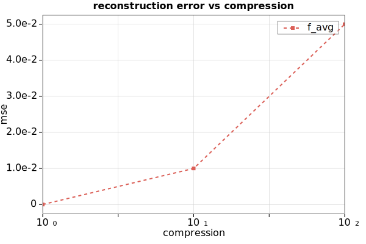

# CHARTER
A simple markdown **DSL** and **C Library** to generate *svg* and *pgfplot* (*LaTeX*)  plot from a minimal syntax.


## Example

Few examples are available in the [gallery](https://github.com/Mandarancio/charter/wiki/Gallery) page of the wiki.

Simple syntax example:

```
title: reconstruction error vs compression
x-axis:
	label: compression
	mode: log
y-axis:
	label: mse
plot:
	x: 1 10    100
	y: 0 0.01  0.05
	label: f_avg
 	marker: s
 	ls: --
```

Resutls in:



**Note:** as the image is an svg the rendering of it is browser dependent.

## DSL Syntax

| syntax | description |
| :----- | :------  |
|```plot```| create a new line plot|
|```scatter```| create a new scatter plot|
|```bar```| create a new bar plot  |
|```x-axis```| parameters for the x axis |
|```y-axis```| parameters for the y axis |
|```label``` | label for axis or plot |
|```x```| x values of a plot |
|```y```| y values of a plot | 
|```color```| colour of a plot |  
|```line-width``` or ```lw```| plot line width |
|```line-style``` or ```ls```| plot line style ('--' or 'dashed', '-' or 'normal', ':' or dotted, '/' or 'none')|
|```bar-width``` or ```bw``` | bar plot width|
|```line-color```| bar plot line color |
|```marker```| marker style of a plot ('o', 'x', '+', 's', ' ')|
|```range```| min and max value for an axis |
|```mode``` | axis mode ('linear' or 'log') |
|```title```| plot title |
|```width```| plot width |
|```height```| plot height |
|```csv://file_path#tag```| load a csv and use column ```tag``` as values |
|```range: min max nstep```| linear range to use as values |
|```logrange: min max nstep```| log range to use as values |
|```math: f(x)```| math expression based on x to use as y value |

**commas** and **spaces** are valid separator for arrays and the sytax in general.
For the definitions **spaces**, **tabs** and **:** are equivalents. So ```x: 1 2 3``` is equal to ```x 1,2,3```.

## Use as a library
if you want to include charter as a library here a simple example

```c
#include "charter/parser.h"
#include "charter/renderer.h"

\***
 * YOUR CODE
 ***\
 chart * parsed = parse_chart(string_to_parse);
 /* chart is the structure you can also create it programmatically in your code
    and render it to svg using chart_to_svg */
 char * svg = chart_to_svg(parsed);
 chart_free(parsed);
\***\
```

## Use as SVG generator

The build process generate as well an executable: ```charter```. It is capable of generate an svg plot from a charter dsl file:

```
charter your_dsl_file > output.svg
```

## Build and install

Use ```meson``` and ```ninja```:

```bash
mkdir build
cd build
meson ..
ninja 
sudo ninja install
```
## Future improvements

In the next future I will improve the svg quality, the memory performance, and the look and feel of the output plus the following features:
 
 - more options on grid
 - more styling options
 - better typesettings

## Marker integration
At the moment _charter_ is integrated in [Marker](https://github.com/fabiocolacio/Marker/)!


## Credits

 - [csv_parser](https://github.com/JamesRamm/csv_parserhttps://github.com/JamesRamm/csv_parser) 
 - [tinyexpr](https://github.com/codeplea/tinyexpr)
